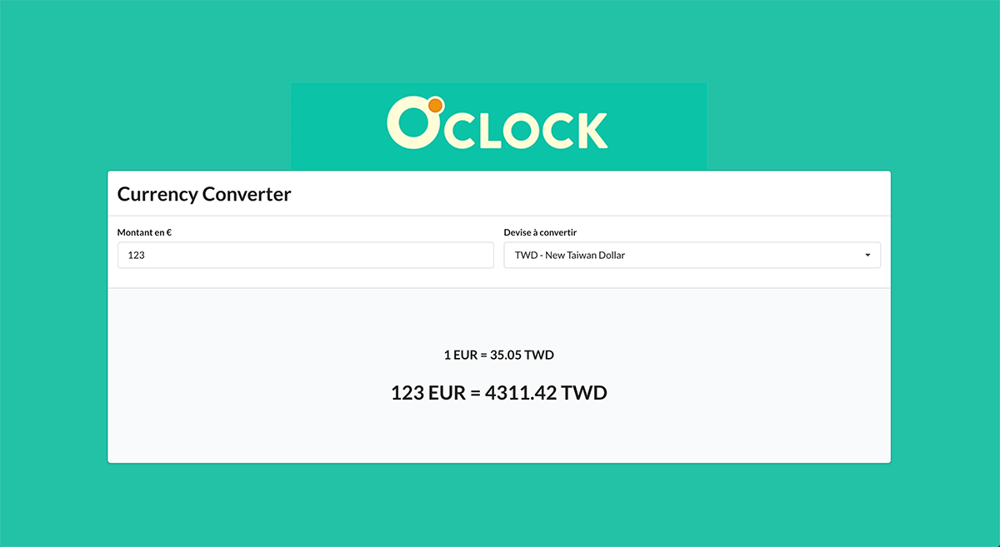

# Préparation du projet

Rendez-vous dans le répertoire du projet et taper

	yarn

ou 

	npm install

# Préparer le fichier de config

Renseignez votre clé d'API fixer dans src/config.js

```js
export const API_KEY = "VOTRE_CLE_FIXER";
```

# Lancement du serveur de dev

	yarn start

ou

	npm start

# Mise en production

	yarn build

ou

	npm build

# Dépendances

Le projet utilise react@16.7.0-alpha ainsi que react-dom@16.7.0-alpha. Ces deux packages permettent d'utiliser les Hooks, nouveauté disponibles uniquement dans cette version alpha, pour le moment.

# Spécifications

Le but est de consommer l'api de http://fixer.io (l'obtention d'un API KEY est gratuite), pour
construire un convertisseur de devise en temps réel.

# Résultat attendu

* Une application permettant de renseigner dans un champ de saisie une somme en euros, et d'avoir la conversion dans une autre devise. Une liste déroulante permet de sélectionner la devise dans laquelle la somme en euros doit être convertie.
* Le calcul doit être instantané : dès que le montant en euros change ou que la devise sélectionnée change, le montant converti doit changer.
* Utilisation de la library React. Point bonus si utilisation des Hooks de React 16.7 ! Libre utilisation de tout autre libraries de l'écosystème JS.
* Pas de charte graphique imposée, mais c'est l'occasion de montrer que tu es capable de développer un truc propre :)